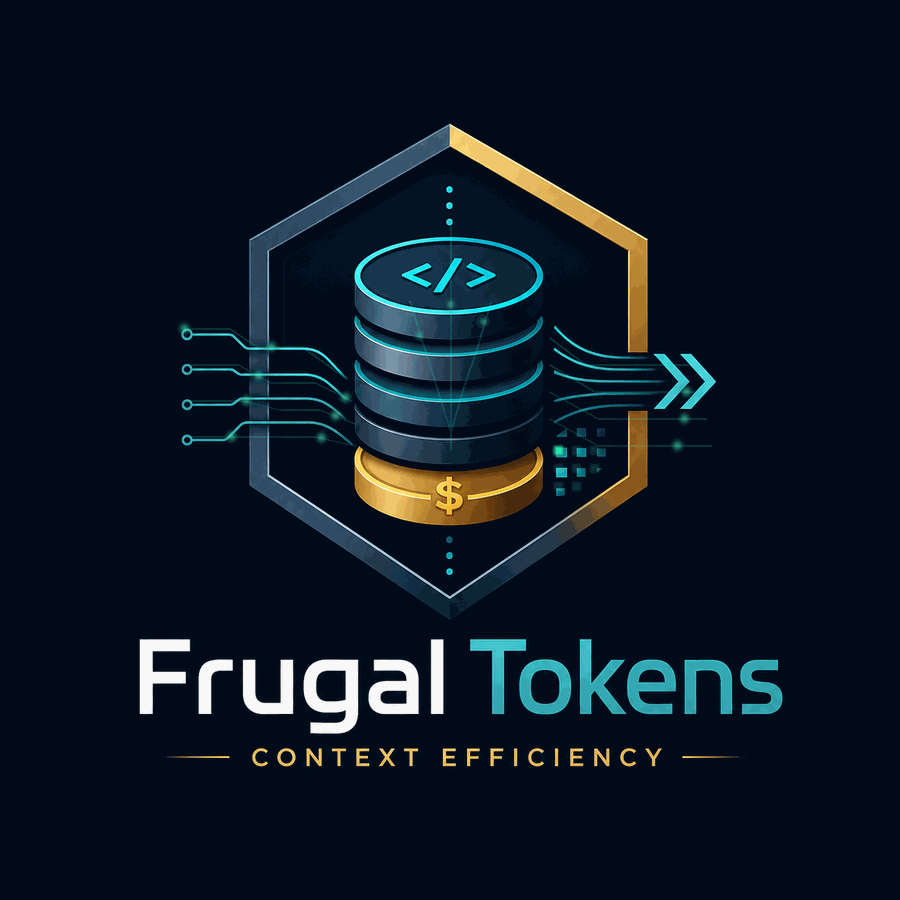
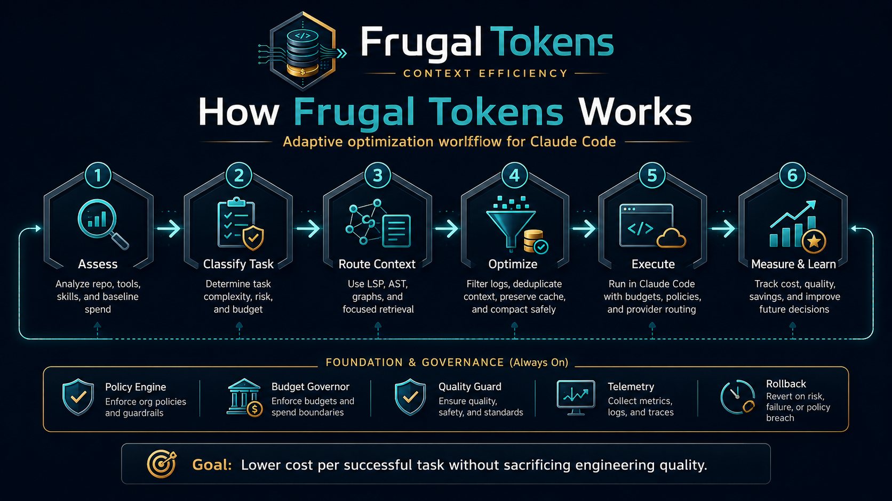
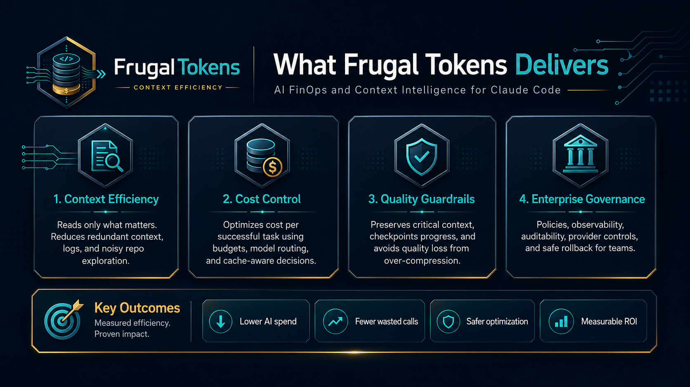

<div align="center">



# Frugal Tokens

**Token & context economy discipline for Claude Code.**

*Less context. Fewer wasted calls. Lower AI spend. Same engineering quality.*

[](skill/SKILL.md)
[](LICENSE)
[](docs/OVERVIEW.md)

</div>

---

## The Core Idea

Most token "optimizers" chase raw token reduction. That metric is broken: a
compression that saves 50% of tokens but causes one extra debugging cycle costs
*more* than the unoptimized workflow.

Frugal Tokens optimizes a single objective instead:

```text
CST  =  Total AI Cost / Successfully Completed Tasks      →  minimize
```

Every rule in the skill is subordinate to it. Information the task needs to
succeed is never dropped — frugality that degrades quality is waste, not savings.

## What It Delivers

<div align="center">

</div>

The skill installs seven always-on disciplines:

| # | Discipline | What Claude does differently |
|---|---|---|
| 1 | **Context tiering** | Classifies every candidate context by value-per-token (Tier 0 critical → Tier 4 disposable) and refuses low-value loads |
| 2 | **Cheap-first navigation** | LSP/AST → targeted grep → partial read → full read; broad scans become the last resort |
| 3 | **Progressive expansion** | Starts with the minimum context and expands only on concrete evidence of failure |
| 4 | **Tool output firewall** | Extracts errors, failed tests, and project stack frames; never ingests raw build logs or blindly truncates |
| 5 | **Model & delegation routing** | Deterministic work → scripts; exploration → subagents; strongest model reserved for security/architecture |
| 6 | **Cache & session protection** | Keeps stable prompt prefixes stable, checkpoints before compaction, compacts only at task boundaries |
| 7 | **Budget & loop guard** | Detects repeated-error loops and resets strategy instead of paying for identical retries |

## How It Works

<div align="center">

</div>

The skill uses **progressive disclosure** — it practices what it preaches:

The repository holds two cleanly separated components — the **skill** (the
behavioral discipline) and the **plugin** (the measurement runtime). The
skill points to the plugin for telemetry; each installs independently.

```text
frugal-tokens/
├── skill/                                ← THE SKILL — behavioral layer
│   ├── SKILL.md                          ← always loaded: the 7 disciplines (compact)
│   ├── references/                       ← loaded only when the situation demands it
│   │   ├── context-tiers.md              ← CVS formula, tier policies, diff-first context
│   │   ├── tool-output-firewall.md       ← per-tool filtering recipes (pytest, tsc, docker…)
│   │   ├── model-routing.md              ← complexity ladder, subagent delegation rules
│   │   ├── checkpoints-and-compaction.md ← token pressure levels, semantic checkpoints
│   │   ├── cache-discipline.md           ← prompt layering, fixed context tax audit
│   │   ├── budget-and-loop-guard.md      ← loop breaker, escalation budgets
│   │   ├── providers.md                  ← vetted open-source optimizers + install commands
│   │   └── setup-flow.md                 ← guided transactional provider setup
│   ├── scripts/                          ← stdlib-only Python: providers, conflicts, ROI, setup
│   └── providers/                        ← bundled provider manifests (e.g. DeepWiki)
├── claude-plugin/                        ← THE PLUGIN — measurement layer
│   ├── commands/                         ← /frugal-tokens:* commands
│   ├── hooks/                            ← telemetry + PreCompact auto-checkpoint
│   ├── bin/frugal.py                     ← Python reference runtime
│   └── .mcp.json                         ← registers the `frugal mcp` server
├── crates/                               ← Rust workspace: Frugal Core native runtime
│   ├── frugal-storage/                   ← SQLite data plane (schema shared with Python runtime)
│   ├── frugal-policy/                    ← profiles + budgets (config.json)
│   ├── frugal-telemetry/                 ← event writers + semantic checkpoints
│   ├── frugal-hooks/                     ← hook ingestion, duplicate fingerprinting (fail-open)
│   ├── frugal-providers/                 ← provider registry + conflict resolver
│   ├── frugal-core/                      ← economics aggregation, health score
│   ├── frugal-mcp/                       ← MCP server: 11 frugal_* tools over stdio
│   ├── frugal-tui/                       ← Ratatui dashboard (6 screens, live refresh)
│   └── frugal-cli/                       ← the `frugal` binary
└── docs/
    └── OVERVIEW.md                       ← product overview
```

Only the compact `SKILL.md` occupies context by default. Reference files load
when their trigger appears — a failing build pulls the firewall recipes, rising
context pressure pulls the checkpoint protocol.

## Install

Skill and plugin are independent — install one or both. Together they cover
discipline (skill) and measurement (plugin).

### The plugin (measurement layer)

Local telemetry, a cost/context status line, duplicate-read detection,
budgets, auto-checkpoints before compaction, a terminal dashboard, and
`/frugal-tokens:*` commands. Local-first — no account, no cloud. See
[claude-plugin/README.md](claude-plugin/README.md) and the
[Product Overview](docs/OVERVIEW.md).

```text
/plugin marketplace add CaptainDigitals/frugal-tokens
/plugin install frugal-tokens@frugal-tokens
/frugal-tokens:setup
```

Starts in **SHADOW mode**: observe-only until you opt into more.

```text
◈ FRUGAL │ CTX 43% │ $1.42 │ dup 3 │ SHADOW ✓
```

### The skill (behavioral layer)

Copy the `skill/` directory into your Claude Code skills directory:

```bash
git clone --depth 1 https://github.com/CaptainDigitals/frugal-tokens.git /tmp/frugal-tokens && cp -r /tmp/frugal-tokens/skill ~/.claude/skills/frugal-tokens && rm -rf /tmp/frugal-tokens
```

Windows (PowerShell):

```powershell
git clone --depth 1 https://github.com/CaptainDigitals/frugal-tokens.git "$env:TEMP\frugal-tokens"; Copy-Item -Recurse "$env:TEMP\frugal-tokens\skill" "$env:USERPROFILE\.claude\skills\frugal-tokens"; Remove-Item -Recurse -Force "$env:TEMP\frugal-tokens"
```

For a single project, copy to `.claude/skills/frugal-tokens` instead. The
skill is discovered automatically and applies to every session.

## How To Use

The skill is an **encoded preference**: it changes Claude's default behavior on
every task with no invocation needed. You'll notice it as:

- **Targeted reads** — partial file reads and symbol lookups instead of whole-repo ingestion
- **Summarized tool output** — "3 unique errors, 2 modules, root cause candidate" instead of 10,000 log lines
- **Delegated exploration** — "which files control auth?" runs in a subagent and returns paths, not file dumps
- **Checkpoints before compaction** — engineering state survives context resets
- **Loop breaks** — "this is the 4th identical error; resetting strategy" instead of a 5th retry

You can also lean on it explicitly:

```text
"Estimate the token cost of loading src/ before you read anything."
"We're at 70% context — apply the frugal-tokens pressure protocol."
"Checkpoint the session state before compacting."
```

Cost-preview a directory before letting any of it into context:

```bash
python skill/scripts/estimate_tokens.py src/ --top 10
```

```text
 est. tokens  file
      18,742  src/generated/api-client.ts
       9,310  src/auth/session.ts
       ...
----------------------------------------
     104,271  TOTAL across 87 files
```

## Optional Providers & Runtime

The core skill has zero dependencies. When the workload justifies it, vetted
open-source providers (ast-grep, LSP servers, [Graphify](https://github.com/DCS-Hub-DCS/Graphify),
[token-compact](https://github.com/theosib/token-compact),
[token-saver](https://github.com/bryanvine/token-saver)) can amplify it. The
provider framework is executable:

```bash
# what's installed, with install hints for what's missing
python skill/scripts/frugal_providers.py status

# validate a proposed active set — one provider per exclusive capability,
# explicit conflicts resolved by priority, requirements checked
python skill/scripts/frugal_conflicts.py --enable ast-grep graphify token-compact

# record real task economics, then prove (or disprove) the savings
python skill/scripts/frugal_roi.py record --phase baseline --task "fix auth race" \
    --input-tokens 82000 --output-tokens 9000 --cache-read 22000 \
    --cost 1.84 --retries 1 --success
python skill/scripts/frugal_roi.py report
```

```text
ASSESSMENT
  verdict             EXCELLENT
  cost improvement    43.5%
  efficiency          1.77x
  retry increase      -0.5
  quality loss        0.0%
```

The ROI report applies a strict acceptance rule: an optimization stays
only if cost improves ≥ 10% **and** retries increase ≤ 5% **and** quality loss
stays ≤ 3%. Providers that don't earn their place get flagged for removal.

### Adaptive Install / Disable / Uninstall

The recommender profiles your actual repository and adapts over time — measured
ROI overrides heuristics, so a provider that proves itself stays and one that
underperforms gets flagged for removal:

```bash
python skill/scripts/frugal_setup.py recommend      # profile repo → per-provider advice
python skill/scripts/frugal_setup.py install graphify
python skill/scripts/frugal_setup.py disable token-compact   # parked, skipped next session
python skill/scripts/frugal_setup.py enable token-compact    # back for the next session
python skill/scripts/frugal_setup.py uninstall token-saver   # recoverable backup (--purge to delete)
python skill/scripts/frugal_setup.py state
```

```text
  graphify  [COMMUNITY, not installed]
    RECOMMENDED — large codebase (~426,930 code tokens) — graph navigation
    beats repeated raw exploration

  token-compact  [COMMUNITY, not installed]
    NOT_RECOMMENDED — few docs — nothing to compress; its fixed context tax
    would be pure cost
```

**New optimizers plug in with zero code changes**: drop a JSON manifest into
`~/.frugal/providers/<id>.json` declaring its capabilities, and routing,
conflict solving, workload recommendations, the install lifecycle, and ROI
measurement all pick it up automatically — recommendation intelligence is
keyed by capability (`navigation.graph`, `compression.document`, …), not by
hardcoded provider ids.

Ask Claude to *"set up frugal tokens providers"* and it follows the guided,
transactional flow in [skill/references/setup-flow.md](skill/references/setup-flow.md):
assess → baseline → recommend → backup → apply one at a time → verify ROI,
with rollback on any failure. Nothing is installed without your approval.

## What This Is (and Isn't)

This repository is the open Community Edition of the Frugal Tokens platform —
a behavioral skill, a plugin with local telemetry, and a native runtime. The
[Product Overview](docs/OVERVIEW.md) describes what it delivers and the
principles it runs on.

It is **not** an output truncator, a proxy, or a guaranteed-percentage discount.
It never deletes important context to save money.

## Anti-Patterns It Exists to Kill

- Reading the whole repo "to be safe"
- Truncating logs by line count (the error was on line 4,317)
- Re-reading unchanged files
- Compacting mid-debugging and losing fragile state
- Cheap-model routing for auth, crypto, and migrations
- Celebrating a 50% token cut that caused a 20% retry increase

## License

[MIT](LICENSE) © CaptainDigitals
