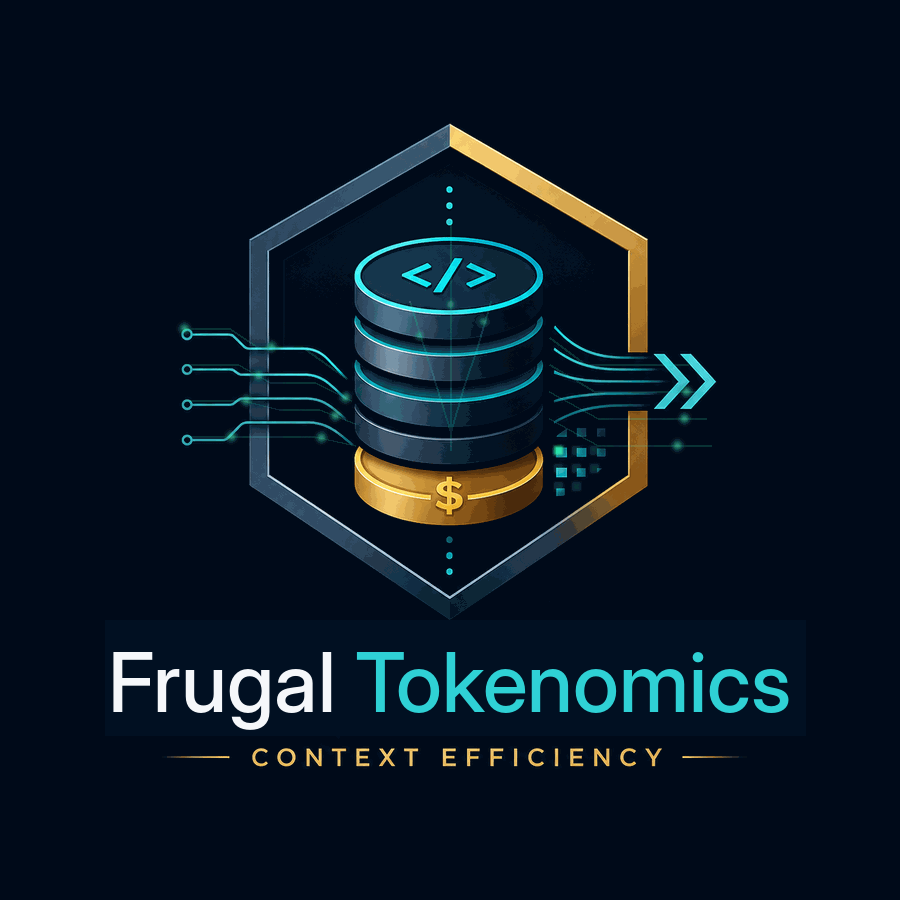

<div align="center">

</div>

# Frugal Tokenomics — Product Overview

**AI FinOps + Context Intelligence for Claude Code.**
Free, open source, local-first. No account, no cloud, no telemetry backend.

> Less context. Fewer wasted calls. Lower AI spend. Same engineering quality.

## What It Is

Frugal Tokenomics is an economics layer around Claude Code. It makes AI coding
spend visible, prevents common sources of context waste, and measures its own
impact against your real usage — locally, on your machine.

It is guided by one principle: **optimize cost per successful task, not raw
tokens**. A "saving" that causes a retry or a wrong patch isn't a saving.
Optimizations must prove themselves against measured baselines before they
earn a place in your workflow.

## What You Get

**Visibility**
- Live status line: context %, session cost, duplicate-call count, budget health
- Interactive terminal dashboard (Ratatui TUI): overview, tool analytics,
  budgets, providers, checkpoints, audit trail
- Session stats, daily/monthly rollups, JSON/CSV export

**Waste prevention**
- Duplicate tool-call detection (identical tool + input repeated in a session)
- Context-discipline skill: targeted reads, filtered tool output, delegated
  exploration, cache-friendly prompting
- Loop awareness — repeated identical failures get named, not silently retried

**Protection**
- Semantic checkpoints of engineering state, written automatically before
  compaction, so context resets never lose your work
- Local task/session/daily budgets (Community warns; it never blocks)
- Safe Mode: one command back to observe-only

**Extensibility**
- Provider framework: optional third-party optimizers (code-graph navigation,
  document compression, billing audits) register via simple JSON manifests
  with trust classes and conflict rules — new tools plug in with no code changes
- MCP server (`frugal mcp`): Claude can query its own economics through
  structured `frugal_*` tools
- Measured ROI: providers that don't demonstrably lower cost per successful
  task get flagged for removal

## Guarantees

- **Shadow-first** — installs in observe-only mode; nothing changes until you opt in
- **Fail-open** — a Frugal failure can never block Claude Code
- **Local-only** — all data lives in `~/.frugal/`; nothing leaves your machine
- **No raw secrets** — the ledger stores names, hashes, counts, and costs;
  never source code, prompts, or credentials
- **Explainable** — every recorded observation can be queried and explained

## Architecture (High Level)

```text
Claude Code ── plugin (skills · hooks · MCP · status line)
                  │
             Frugal Core (Rust workspace + Python reference runtime)
                  │
             Local data plane (SQLite, ~/.frugal/)
                  │
             Frugal TUI / CLI / reports
```

## Editions

- **Community** (this repo): everything a single developer needs to
  understand and optimize their own Claude Code environment. Complete, not a
  demo.
- **Enterprise** (future, separate): organization-level governance —
  centralized policy, team budgets, fleet analytics, SSO. The boundary is
  simple: *Community optimizes my environment; Enterprise governs ours.*

## Honest Claims

Savings depend on workload. Frugal Tokenomics measures rather than promises —
its reports distinguish measured, estimated, and projected savings, and its
quality guard exists precisely so cost cuts never silently degrade outcomes.
